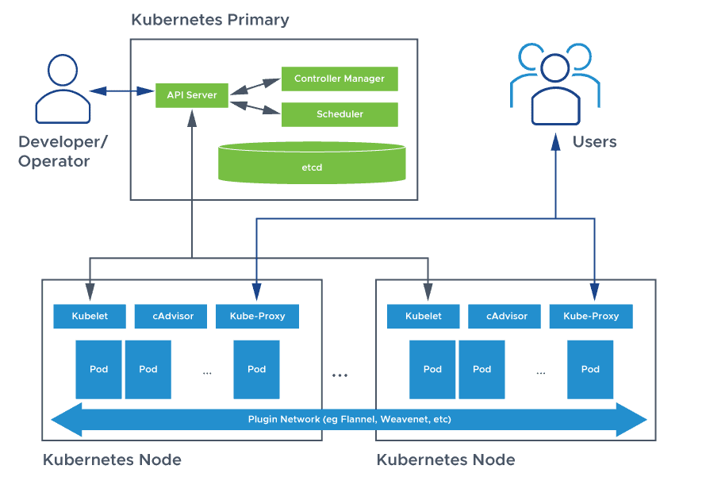

This is a repo for me to access all resources to learn/brush up kubernetes concepts

Kubernetes is an open source container deployment and management platform. It offers container orchestration, a container runtime, container-centric infrastructure orchestration, load balancing, self-healing mechanisms, and service discovery. Kubernetes architecture, also sometimes called Kubernetes application deployment architecture or Kubernetes client server architecture, is used to compose, scale, deploy, and manage application containers across host clusters.

An environment running Kubernetes consists of the following basic components: a control plane (Kubernetes control plane), a distributed key-value storage system for keeping the cluster state consistent (etcd), and cluster nodes (Kubelets, also called worker nodes or minions).

What is Kubernetes Architecture?

A Kubernetes cluster is a form of Kubernetes deployment architecture. Basic Kubernetes architecture exists in two parts: the control plane and the nodes or compute machines(Data Plane). Each node could be either a physical or virtual machine and is its own Linux environment. Every node also runs pods, which are composed of containers.

Kubernetes architecture components or K8s components include the Kubernetes control plane and the nodes in the cluster. The control plane machine components include the Kubernetes API server, Kubernetes scheduler, Kubernetes controller manager, and etcd. Kubernetes node components include a container runtime engine or docker, a Kubelet service, and a Kubernetes proxy service.

